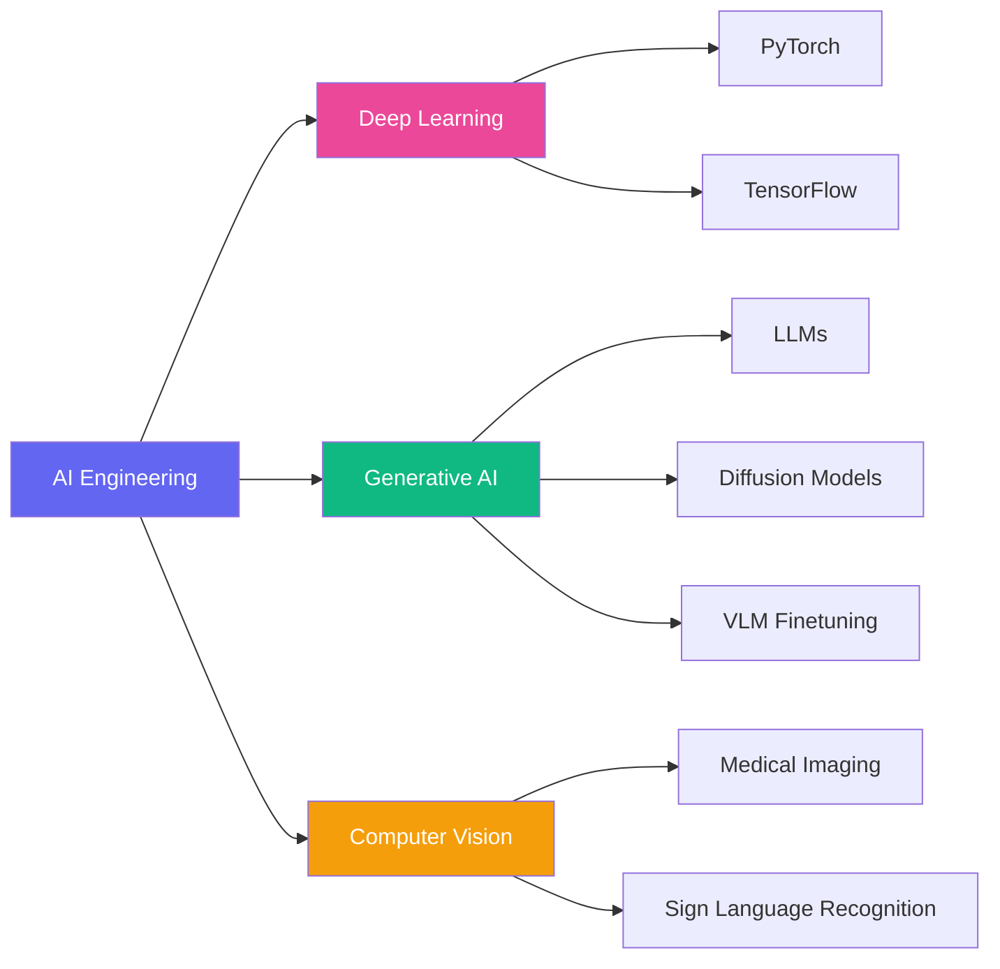
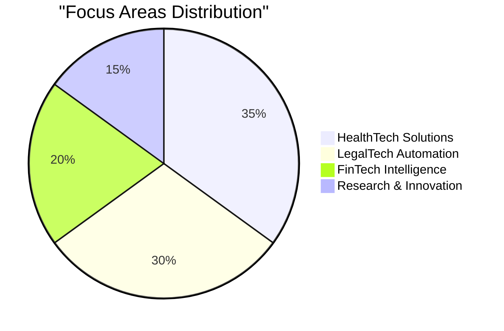

<div align="center">

#  I'm Hammale Mourad

[](https://git.io/typing-svg)

<a href="https://www.linkedin.com/in/hammale-mourad-5117a5247/"></a>
<a href="https://huggingface.co/HAMMALE"></a>

</div>

---

## 🎯 Mission

```typescript
const hammale = {
    role: "AI Engineering Student",
    school: "CentraleSupélec",
    passion: ["Generative AI", "Deep Learning", "Intelligent Systems"],
    impact: "Transforming knowledge → Real-world solutions",
    domains: ["LegalTech 🏛️", "HealthTech 🏥", "FinTech 💳"]
};
```

---

## 🚀 Featured Projects

<table>
<tr>
<td width="50%">

### 🏥 **MediAssist**
 

**Medical Report → Speech + Sign Language**

Convert complex medical reports into:
- 🎤 **Audio** (Text-to-Speech)
- 🤟 **Sign Language** (Visual translation)
- ♿ Making healthcare accessible for all

**Tech:** `PyTorch` `Transformers` `Computer Vision` `Speech AI`

</td>
<td width="50%">

### 🧤 **Smart Sign Language Glove**
 

**Sign Language → Real-time Audio**

Smart glove translating gestures into speech:
- 🤖 **Real-time processing**
- 🎯 **High accuracy detection**
- 🔊 **Natural voice synthesis**

**Tech:** `TensorFlow` `Edge AI` `Arduino` `Speech Synthesis`

</td>
</tr>
</table>

---

## 🧠 Expertise Matrix



<div align="center">

**Deep Learning** • **Generative AI** • **LLMs** • **Computer Vision** • **Speech AI** • **Reinforcement Learning**  
**Knowledge Distillation** • **Model Compression** • **Quantization** • **Continual Learning** • **AI Agents**  
**LegalTech** • **HealthTech** • **FinTech** • **Startup Innovation** • **Research & Leadership**

</div>

---

## 💻 Tech Arsenal

<div align="center">

### AI/ML


### Generative AI


### Development


</div>

---

## 📊 GitHub Activity

<div align="center">


</div>

---

## 🎨 Impact Spectrum



<div align="center">

| 🏛️ **LegalTech** | 🏥 **HealthTech** | 💳 **FinTech** |
|:---:|:---:|:---:|
| Automating legal workflows | Accessible healthcare AI | Smart financial systems |
| Document processing | Medical report translation | Fraud detection |
| Compliance AI | Sign language tech | Risk analysis |

</div>

---

<div align="center">

### 💡 *Building AI that empowers people, not replaces them*


</div>
