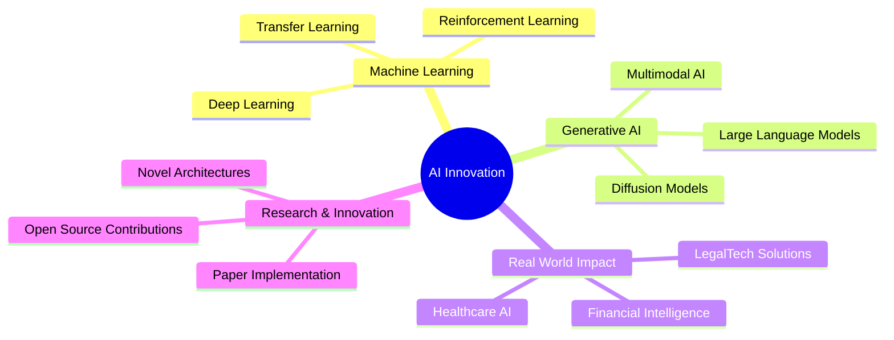

# <div align="center">👋 Welcome to My Digital Universe</div>

<div align="center">
  
  [](https://git.io/typing-svg)
  
</div>

<div align="center">
  
  [](https://www.linkedin.com/in/hammale-mourad-5117a5247/)
  [](https://huggingface.co/HAMMALE)
  [](mailto:votre.email@example.com)
  
</div>

---

## 🌟 Who Am I?

```python
class AIEngineer:
    def __init__(self):
        self.name = "Mourad Hammale"
        self.role = "AI Engineering Student"
        self.school = "CentraleSupélec"
        self.mission = "Transforming Knowledge into Impact"
        self.vision = "Building a Smarter, More Inclusive Future"
        
    def get_expertise(self):
        return {
            "domains": ["Machine Learning", "Generative AI", "Intelligent Systems"],
            "industries": ["LegalTech", "HealthTech", "FinTech"],
            "impact": [
                "Automating complex legal processes",
                "Making healthcare more accessible",
                "Bridging technology with human needs"
            ]
        }
    
    def current_focus(self):
        return "Exploring the frontiers of AI and building solutions that empower people"

me = AIEngineer()
print(me.current_focus())
# Output: Exploring the frontiers of AI and building solutions that empower people
```

---

## 🚀 My Tech Arsenal

<div align="center">

### 🧠 AI & Machine Learning


### 🎨 Generative AI & LLMs


### 💻 Development & Tools


### ☁️ Cloud & Data


</div>

---

## 🎯 Impact Across Industries

<table>
<tr>
<td width="33%" align="center">

### ⚖️ LegalTech
**Automating Legal Processes**

Designing AI systems that streamline complex legal workflows, making justice more accessible and efficient

</td>
<td width="33%" align="center">

### 🏥 HealthTech
**Accessible Healthcare**

Building intelligent solutions that democratize healthcare, bringing medical expertise to everyone, everywhere

</td>
<td width="33%" align="center">

### 💰 FinTech
**Smart Financial Systems**

Creating AI-powered tools that make financial services more intelligent, secure, and user-friendly

</td>
</tr>
</table>

---

## 📊 GitHub Analytics

<div align="center">
  
  
  
  
</div>

<div align="center">
  
  [](https://git.io/streak-stats)
  
</div>

---

## 🏆 Achievements & Highlights

<div align="center">


</div>

---

## 🌐 Explore My AI Universe

<div align="center">

### 🤗 Hugging Face Hub
*Discover my AI models, datasets, and experiments*

[](https://huggingface.co/HAMMALE)

</div>

---

## 💡 My Philosophy

<div align="center">

> *"At the intersection of artificial intelligence and human ambition lies the power to reshape our world. I don't just build algorithms — I architect experiences that empower, solutions that transform, and innovations that inspire."*

</div>

---

## 🔥 Current Focus Areas



---

## 📈 Activity Graph

[](https://github.com/VOTRE_USERNAME)

---

## 🤝 Let's Build the Future Together

<div align="center">

**I'm always open to collaborating on innovative AI projects!**

Whether you're working on cutting-edge research, building impactful applications, or just want to discuss the future of AI — let's connect!

[](https://www.linkedin.com/in/hammale-mourad-5117a5247/)
[](https://huggingface.co/HAMMALE)
[](mailto:votre.email@example.com)

</div>

---

<div align="center">
  
  ### 💭 Quote of the Day
  
  [](https://github.com/piyushsuthar/github-readme-quotes)
  
</div>

---

<div align="center">
  
  
  
  **✨ Transforming Ideas into Innovations | One Algorithm at a Time ✨**
  
</div>

---

<div align="center">
  
</div>
