<div align="center">

# 🎮 Loading Profile...

[](https://git.io/typing-svg)

```ascii
╔══════════════════════════════════════════════════════════════╗
║  🎯 AI Engineering Student @ CentraleSupélec                 ║
║  🚀 Building AI Solutions that Transform Lives               ║
║  💡 LegalTech • HealthTech • FinTech Innovator              ║
╚══════════════════════════════════════════════════════════════╝
```

[](https://www.linkedin.com/in/hammale-mourad-5117a5247/)
[](https://huggingface.co/HAMMALE)

</div>

---

## 🎯 >> QUEST: Current Mission

<div align="center">

[](https://git.io/typing-svg)

</div>

---

## 🏆 >> ACHIEVEMENTS: Featured Projects

<table>
<tr>
<td width="50%">

### 🏥 **MEDIASSIST**
```diff
+ Medical Report → Text/Audio/Sign Language
+ Smart Healthcare Accessibility Platform
+ Multi-modal AI Translation System
```

**Tech Stack:**
- 🎤 Speech Recognition & Synthesis
- 🤖 NLP & Medical Entity Extraction
- 👋 Sign Language Generation
- 🔊 Audio Processing

<div align="center">


</div>

</td>
<td width="50%">

### 🧤 **Smart Sign Language Glove**
```diff
+ Sign Language → Real-time Audio
+ Wearable AI for Deaf Communication
+ IoT + Deep Learning Integration
```

**Features:**
- 🎯 Gesture Recognition via Sensors
- 🔊 Instant Voice Output
- 📡 Wireless Connectivity
- 🧠 On-device ML Inference

<div align="center">


</div>

</td>
</tr>
</table>

---

## 🎮 >> SKILL TREE

```mermaid
%%{init: {'theme':'dark', 'themeVariables': { 'primaryColor':'#00D9FF','primaryTextColor':'#fff','primaryBorderColor':'#00D9FF','lineColor':'#F7931E','secondaryColor':'#006100','tertiaryColor':'#fff'}}}%%
mindmap
  root((🧠 AI Arsenal))
    🤖 Deep Learning
      PyTorch
      TensorFlow
      Keras
    🎨 Generative AI
      LLMs
      Diffusion Models
      VLM Finetuning
    🔬 Specialized
      Knowledge Distillation
      Model Compression
      Quantization
    💡 Applications
      LegalTech AI
      HealthTech AI
      Speech AI
      Computer Vision
    🛠️ MLOps
      LLMOps
      Model Deployment
      A/B Testing
```

<div align="center">



</div>

---

## ⚡ >> POWER UPS: Tech Stack

<div align="center">

### 🧠 AI & ML Core


### 🎨 Generative AI & LLMs


### 🔊 Speech & Vision


### 💻 Development


### ☁️ Cloud & MLOps


</div>

---

## 📊 >> STATS: Player Profile

<div align="center">


</div>

---

## 🌍 >> IMPACT ZONES

<div align="center">

```diff
╔════════════════════════════════════════════════════════════════╗
║                    🎯 AREAS OF IMPACT                          ║
╠════════════════════════════════════════════════════════════════╣
║                                                                 ║
║  ⚖️  LEGALTECH        →  Automating Legal Workflows           ║
║  🏥  HEALTHTECH       →  Accessible Medical Solutions         ║
║  💰  FINTECH          →  Intelligent Financial Systems        ║
║  🗣️  ACCESSIBILITY    →  Breaking Communication Barriers      ║
║                                                                 ║
╚════════════════════════════════════════════════════════════════╝
```

</div>

---

## 🎓 >> EXPERTISE BADGES

<div align="center">

**🔥 CORE SKILLS 🔥**

`Deep Learning` `Generative AI` `LLMs` `Knowledge Distillation` `Continual Learning` `Computer Vision` `LegalTech AI` `HealthTech AI` `VLM Finetuning` `Diffusion Models` `Pretraining` `Finetuning` `Embeddings` `Speech AI` `Reinforcement Learning` `AI Agents` `Model Compression` `Quantization` `LLMOps` `NLP` `Security AI` `Web Scraping` `Leadership` `Research & Innovation` `Startup Creation`

</div>

---

## 🎬 >> ACTIVITY FEED

<div align="center">

[](https://github.com/VOTRE_USERNAME)

</div>

---

## 🏅 >> ACHIEVEMENTS UNLOCKED

<div align="center">


</div>

---

## 🎯 >> MISSION STATEMENT

<div align="center">

```ascii
╔═══════════════════════════════════════════════════════════════════╗
║                                                                   ║
║   💭  "I don't just build algorithms —                           ║
║       I architect experiences that empower,                       ║
║       solutions that transform,                                   ║
║       and innovations that inspire."                              ║
║                                                                   ║
║   🎯  Transforming Knowledge into Impact                         ║
║   🚀  Building a Smarter, More Inclusive Future                  ║
║                                                                   ║
╚═══════════════════════════════════════════════════════════════════╝
```

</div>

---

## 🤝 >> CONNECT: Join the Party

<div align="center">

[](https://www.linkedin.com/in/hammale-mourad-5117a5247/)
[](https://huggingface.co/HAMMALE)
[](mailto:votre.email@example.com)

</div>

---

<div align="center">


### ⚡ *Powered by Curiosity • Driven by Impact* ⚡


</div>
